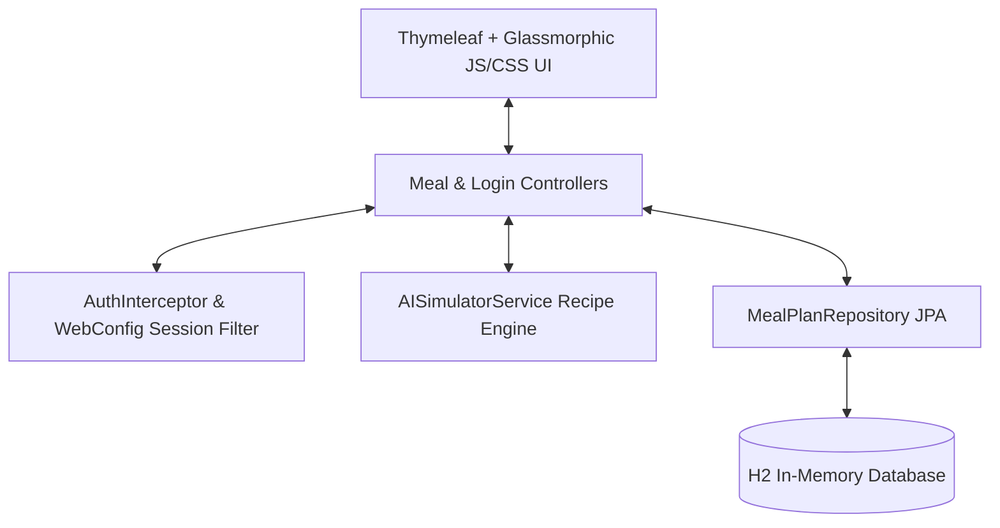

# Saket Kumar Kitchen - AI Cooking Planner

Welcome to **Saket Kumar Kitchen**, a premium, glassmorphic dark-themed AI Cooking Planner built on **Spring Boot 4** and **Java 25**. It helps home cooks plan meals, track calorie profiles, organize checkable grocery shopping tasks, swap budget-friendly substitutes, and checklist cooking directions.

---

## 🎯 Overview & Use Cases

### The Problem
Cooking at home often forces you to juggle multiple disjointed factors: **matching ingredients** you already have, tracking **daily calorie intake**, keeping under a **financial budget**, and following **cooking steps**. Most recipe apps only handle one of these, leaving you to calculate costs, research ingredient substitutions, or manage separate shopping checklists.

### The Solution: Saket Kumar Kitchen
This application provides a **unified workspace** that bridges the gap between meal suggestion, calorie tracking, shopping cost feasibility, and cooking management.

### Primary Use Cases:
1.  **"Fridge-First" Meal Planning (The Fridge Cleaner)**:
    *   *Scenario*: You have ingredients like `spinach, eggs` in your fridge and want to cook a meal without buying a long list of new items.
    *   *Use Case*: Enter your base items. The AI ranks recipes to prioritize what you own and displays "Ingredients You Have" vs "Need to buy" on separate lists.
2.  **Budget-Conscious Fitness Tracking (The Smart Saver)**:
    *   *Scenario*: You want to stick to a high-protein diet (e.g., post-workout) but need to spend under $25 a day on groceries.
    *   *Use Case*: Set your budget slider and select your day type. The app checks feasibility, alerts you if you are over budget, and provides **one-click ingredient swaps** (e.g., swapping a premium Ribeye for a Sirloin) to instantly lower your total.
3.  **Active Grocery Shopping**:
    *   *Scenario*: You are at the supermarket and need to buy extra ingredients for the week's plan.
    *   *Use Case*: Open the app on your phone. As you place items in your shopping cart, check them off in the **Master Grocery Checklist**. The app dynamically subtracts their cost and updates your spending dials.
4.  **Organized Kitchen Chores**:
    *   *Scenario*: You are preparing the meals and need to track prep steps alongside general kitchen chores.
    *   *Use Case*: Click "+ Add Steps" on the suggested recipes to load their directions into the **Master Cooking To-Do List**. Add custom chores (e.g., *"Preheat oven"*, *"Clean the blender"*) to track your complete cooking progress in one unified bar.

---

## 🌟 Key Features

1.  **AI Dish Recommendations**: Scans a pool of recipes to match the user's available base ingredients first, adjusting for day type (Busy, Workout, Sick, Relaxed), diet preference (Vegan, Vegetarian, Keto, Gluten-Free), and prep times.
2.  **Calorie Profiling**: Calculates total daily calories and breakfast/lunch/dinner distributions against standard nutrition guidelines, visualized via a premium glowing progress ring.
3.  **Feasibility Budget Dials**: Evaluates estimated grocery checklist prices against the user's target spending limit, displayed in a color-coded conic-gradient gauge.
4.  **Interactive Grocery Checklist**: Dynamically aggregates ingredients needed to buy. Checking off items marks them as bought and subtracts their cost from the remaining spend total in real time.
5.  **Smart Substitutions**: Lists cost-saving ingredient swaps (e.g. Ribeye to Sirloin). Clicking "Swap" applies the budget change in the grocery grid dynamically.
6.  **Master Cooking To-Do Checklist**: Unifies recipe instructions and custom manually entered tasks (e.g., preheating the oven) into a central workspace with completion tracking.
7.  **Library History**: Persists and loads previous generation settings using an in-memory SQL database.

---

## 🏗️ Architecture

The project utilizes a modular, decoupled **Spring Boot MVC architecture**:



*   **Presentation Layer**: [index.html](src/main/resources/templates/index.html) and [login.html](src/main/resources/templates/login.html) rendered with Thymeleaf, Vanilla CSS variables, and native JavaScript state tracking.
*   **Security Layer**: Custom [AuthInterceptor](src/main/java/com/example/prompt_war/config/AuthInterceptor.java) and [WebConfig](src/main/java/com/example/prompt_war/config/WebConfig.java) that secure endpoints by checking active session credentials.
*   **Business Logic Layer**: [AISimulatorService](src/main/java/com/example/prompt_war/service/AISimulatorService.java) handles recipes, scoring matching, cost aggregations, and substitutions tags.
*   **Data Access Layer**: [MealPlanRepository](src/main/java/com/example/prompt_war/repository/MealPlanRepository.java) extends JPA to handle database CRUD operations for the [MealPlan](src/main/java/com/example/prompt_war/model/MealPlan.java) entity.

---

## 🚀 How to Run the Project

### Prerequisites
*   **Java 25** or higher.
*   Maven (or the included Maven Wrapper `./mvnw`).

### 1. Start the Application
Run the Spring Boot development server from the project root:
```bash
./mvnw spring-boot:run
```
The server will start on port **`8080`**.

### 2. Authenticate
Access the app at: **[http://localhost:8080/](http://localhost:8080/)**

*   You will be redirected to the secure login screen.
*   **Username**: `admin`
*   **Password**: `admin`

---

## 🗄️ Database Console

The application runs an in-memory SQL H2 database. To inspect database schemas or query raw data:

1.  Open: **[http://localhost:8080/h2-console](http://localhost:8080/h2-console)**
2.  Fill in credentials:
    *   **JDBC URL**: `jdbc:h2:mem:promptwardb`
    *   **User Name**: `sa`
    *   **Password**: `password`
3.  Click **Connect**.

---

## 🧪 Running Tests

The project includes JUnit 5 and MockMvc test suites targeting repository queries and secure controller routes. To execute tests:

```bash
./mvnw clean test
```
All 9 unit tests will compile, run, and report a `BUILD SUCCESS`.
# PromptWar-with-SK
